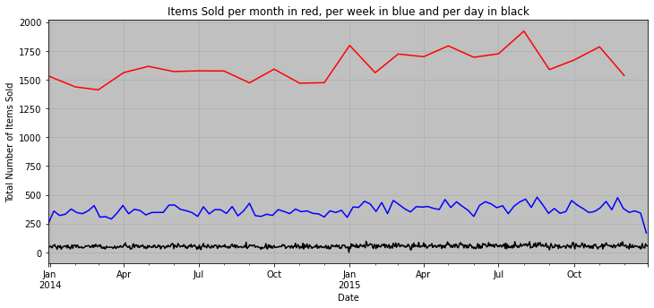
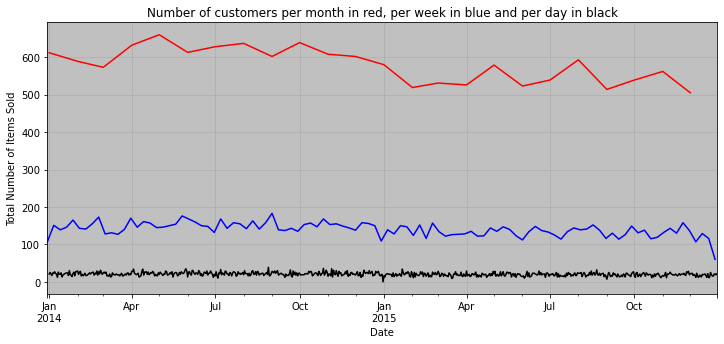
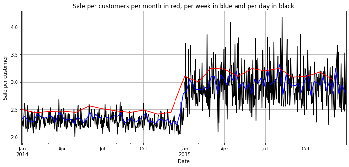
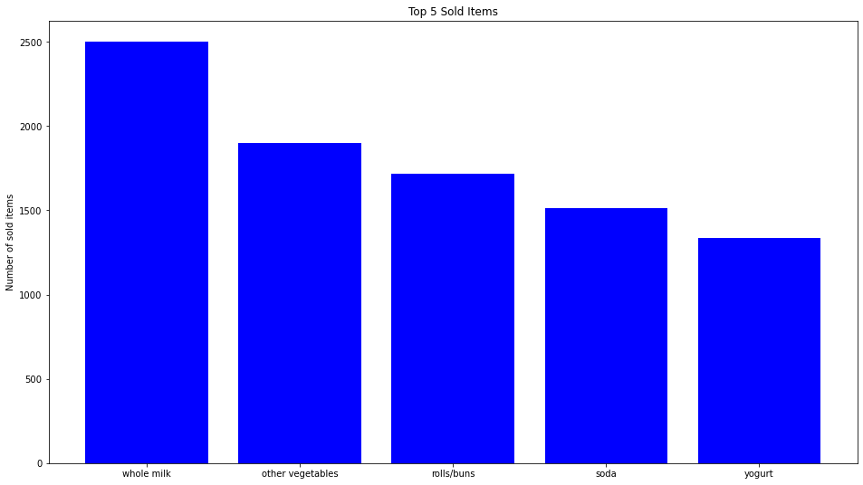

# Market Basket Analysis using Association rule learning

# What is Association rule learning?

Association rule learning is a machine learning technique used to identify patterns, associations, and relationships between variables in large datasets. It is often applied in market basket analysis, where the goal is to discover which products are frequently bought together by customers.
In market basket analysis, confidence, support, and lift are used to measure the strength of association between items purchased by customers.

1. Confidence: Confidence in market basket analysis measures the conditional **probability** of a product Y being purchased given that product X has already been purchased. A high confidence value indicates that customers who bought item X are likely to also buy item Y. 

2. Support: Support measures the **frequency of occurrence** of an item or a set of items in all transactions. A high support value indicates that the item or set of items is frequently bought together by customers.

3. Lift: Lift measures the strength of association between two items by comparing the observed frequency of co-occurrence of both items with the expected frequency of co-occurrence under the assumption that the items are independent. A lift value greater than 1 indicates that the items are positively correlated, a lift value of 1 indicates no correlation, and a lift value less than 1 indicates that they are negatively correlated. A high lift value indicates that the two items are likely to be bought together, and the lift value can be used to identify strong association rules between items.

# 

Two approaches of Asscoaite rule learning, known as appriori and FP growth, have been used to do a market basket analysis.
My code is very simple to understand and can be extended by more analysis.

```python
## data of this code can be downloaded from the following link:
#https://www.kaggle.com/datasets/heeraldedhia/groceries-dataset/code?datasetId=877335&sortBy=voteCount    
import pandas as pd
import matplotlib.pyplot as plt
import numpy as np
from mlxtend.frequent_patterns import apriori, association_rules
from mlxtend.frequent_patterns import fpgrowth
```


```python
#reading data
dataset = pd.read_csv("Groceries_dataset.csv")
#Member_number is unique for each customer. Date is date of the transaction,
#itemDescription is the product bought for this date.
print(dataset.head())
print(dataset.shape)
#################################
#checking missing values
nan_values = dataset.isna().sum()
print(nan_values)
```

       Member_number        Date   itemDescription
    0           1808  21-07-2015    tropical fruit
    1           2552  05-01-2015        whole milk
    2           2300  19-09-2015         pip fruit
    3           1187  12-12-2015  other vegetables
    4           3037  01-02-2015        whole milk
    (38765, 3)
    Member_number      0
    Date               0
    itemDescription    0
    dtype: int64


    /Users/mohamadians/opt/anaconda3/lib/python3.8/site-packages/ipykernel/ipkernel.py:287: DeprecationWarning: `should_run_async` will not call `transform_cell` automatically in the future. Please pass the result to `transformed_cell` argument and any exception that happen during thetransform in `preprocessing_exc_tuple` in IPython 7.17 and above.
      and should_run_async(code)


```python
##Basket analysis: we can see the bought products of clients for everyday
client_basket=dataset.groupby(['Member_number','Date'])['itemDescription'].apply(sum)
print(client_basket)
## we can see the bought products of clients for every day withot client number
clinet_basket2 = [a[1]['itemDescription'].tolist() for a in list(dataset.groupby(['Member_number','Date']))]
print(clinet_basket2[0:10])
```

    /Users/mohamadians/opt/anaconda3/lib/python3.8/site-packages/ipykernel/ipkernel.py:287: DeprecationWarning: `should_run_async` will not call `transform_cell` automatically in the future. Please pass the result to `transformed_cell` argument and any exception that happen during thetransform in `preprocessing_exc_tuple` in IPython 7.17 and above.
      and should_run_async(code)


    Member_number  Date      
    1000           15-03-2015           sausagewhole milksemi-finished breadyogurt
                   24-06-2014                          whole milkpastrysalty snack
                   24-07-2015                           canned beermisc. beverages
                   25-11-2015                              sausagehygiene articles
                   27-05-2015                               sodapickled vegetables
                                                       ...                        
    4999           24-01-2015    tropical fruitberriesother vegetablesyogurtkit...
                   26-12-2015                                   bottled waterherbs
    5000           09-03-2014                          fruit/vegetable juiceonions
                   10-02-2015               sodaroot vegetablessemi-finished bread
                   16-11-2014                         bottled beerother vegetables
    Name: itemDescription, Length: 14963, dtype: object
    [['sausage', 'whole milk', 'semi-finished bread', 'yogurt'], ['whole milk', 'pastry', 'salty snack'], ['canned beer', 'misc. beverages'], ['sausage', 'hygiene articles'], ['soda', 'pickled vegetables'], ['frankfurter', 'curd'], ['sausage', 'whole milk', 'rolls/buns'], ['whole milk', 'soda'], ['beef', 'white bread'], ['frankfurter', 'soda', 'whipped/sour cream']]


```python
#Converting Date into datetime type
Date=dataset.set_index(['Date'])
Date.index=pd.to_datetime(Date.index, infer_datetime_format= True)
```

 


```python
## data analysis
#Items Sold 
fig1 = plt.figure("Figure 1")
ax = plt.axes()
ax.set_facecolor('silver')
Date.resample("D")['itemDescription'].count().plot(figsize=(12,5), grid=True,
color='black').set(xlabel="Date", ylabel="Total Number of Items Sold")
Date.resample("W")['itemDescription'].count().plot(figsize=(12,5), grid=True,
color='blue').set(xlabel="Date", ylabel="Total Number of Items Sold")
Date.resample("M")['itemDescription'].count().plot(figsize=(12,5), grid=True,
color='red',title="Items Sold per month in red, per week in blue and per day in black").set(xlabel="Date", ylabel="Total Number of Items Sold")
```


    [Text(0.5, 0, 'Date'), Text(0, 0.5, 'Total Number of Items Sold')]


    

    


```python
#Number of customers
fig2 = plt.figure("Figure 2")
ax = plt.axes()
ax.set_facecolor('silver')
Date.resample('D')['Member_number'].nunique().plot(figsize=(12,5), grid=True,
color='black').set(xlabel="Date", ylabel="Number of customers")
Date.resample('W')['Member_number'].nunique().plot(figsize=(12,5), grid=True,
color='blue').set(xlabel="Date", ylabel="Number of customers")
Date.resample('M')['Member_number'].nunique().plot(figsize=(12,5), grid=True,
color='red',title="Number of customers per month in red, per week in blue and per day in black").set(xlabel="Date", ylabel="Total Number of Items Sold")
```

 


    [Text(0.5, 0, 'Date'), Text(0, 0.5, 'Total Number of Items Sold')]


    

    


```python
#sale per customer
fig3 = plt.figure("Figure 3")
ax = plt.axes()
day_ratio = Date.resample("D")['itemDescription'].count()/Date.resample('D')['Member_number'].nunique()
day_ratio.plot(figsize=(12,5), grid=True,
color='black').set(xlabel="Date", ylabel="Sale per customer")
week_ratio = Date.resample("W")['itemDescription'].count()/Date.resample('W')['Member_number'].nunique()
week_ratio.plot(figsize=(12,5), grid=True,
color='blue').set(xlabel="Date", ylabel="Sale per customer")
month_ratio = Date.resample("M")['itemDescription'].count()/Date.resample('M')['Member_number'].nunique()
month_ratio.plot(figsize=(12,5), grid=True,
color='red', title = "Sale per customers per month in red, per week in blue and per day in black").set(xlabel="Date", ylabel="Sale per customer")

```


    [Text(0.5, 0, 'Date'), Text(0, 0.5, 'Sale per customer')]


    

    


```python
#5 best seller items 
Item_distr = dataset.groupby(by = 'itemDescription').size().reset_index(name='Frequency').sort_values(by = 'Frequency',ascending=False).head(5)
bars = Item_distr["itemDescription"]
height = Item_distr["Frequency"]
x_pos = np.arange(len(bars))
plt.figure(figsize=(16,9))
plt.bar(x_pos, height, color = 'blue')
plt.title("Top 5 Sold Items")
plt.ylabel("Number of sold items")
plt.xticks(x_pos, bars)
plt.show()
```


    

    


```python
##Data preparation and modeling
## Before modeling, transaction must be one-hot
Transactions = dataset.groupby(['Member_number', 'itemDescription'])['itemDescription'].count().unstack().fillna(0).reset_index()
Transactions.head()
def one_hot_encoder(k):
    if k <= 0:
        return 0
    if k >= 1:
        return 1
Transactions = Transactions.iloc[:, 1:Transactions.shape[1]].applymap(one_hot_encoder)
# Transactions.head()
##associate learning 1: apriori
frequent_items1 = apriori(Transactions, min_support=0.027, use_colnames=True, max_len=3).sort_values(by='support')
frequent_items1.head(10)
results1 = association_rules(frequent_items1, metric="lift", min_threshold=1).sort_values('lift', ascending=False)
results1 = results1[['antecedents', 'consequents', 'support', 'confidence', 'lift']]
results1.head(100)
```


<div>
<style scoped>
    .dataframe tbody tr th:only-of-type {
        vertical-align: middle;
    }

    .dataframe tbody tr th {
        vertical-align: top;
    }

    .dataframe thead th {
        text-align: right;
    }
</style>
<table border="1" class="dataframe">
  <thead>
    <tr style="text-align: right;">
      <th></th>
      <th>antecedents</th>
      <th>consequents</th>
      <th>support</th>
      <th>confidence</th>
      <th>lift</th>
    </tr>
  </thead>
  <tbody>
    <tr>
      <th>629</th>
      <td>(sausage)</td>
      <td>(yogurt, rolls/buns)</td>
      <td>0.035659</td>
      <td>0.173101</td>
      <td>1.554717</td>
    </tr>
    <tr>
      <th>624</th>
      <td>(yogurt, rolls/buns)</td>
      <td>(sausage)</td>
      <td>0.035659</td>
      <td>0.320276</td>
      <td>1.554717</td>
    </tr>
    <tr>
      <th>216</th>
      <td>(root vegetables, whole milk)</td>
      <td>(shopping bags)</td>
      <td>0.029246</td>
      <td>0.258503</td>
      <td>1.536046</td>
    </tr>
    <tr>
      <th>221</th>
      <td>(shopping bags)</td>
      <td>(root vegetables, whole milk)</td>
      <td>0.029246</td>
      <td>0.173780</td>
      <td>1.536046</td>
    </tr>
    <tr>
      <th>627</th>
      <td>(yogurt)</td>
      <td>(rolls/buns, sausage)</td>
      <td>0.035659</td>
      <td>0.126020</td>
      <td>1.530298</td>
    </tr>
    <tr>
      <th>...</th>
      <td>...</td>
      <td>...</td>
      <td>...</td>
      <td>...</td>
      <td>...</td>
    </tr>
    <tr>
      <th>1008</th>
      <td>(rolls/buns, whole milk)</td>
      <td>(sausage)</td>
      <td>0.048743</td>
      <td>0.272989</td>
      <td>1.325167</td>
    </tr>
    <tr>
      <th>805</th>
      <td>(whole milk)</td>
      <td>(yogurt, bottled water)</td>
      <td>0.040277</td>
      <td>0.087906</td>
      <td>1.323001</td>
    </tr>
    <tr>
      <th>800</th>
      <td>(yogurt, bottled water)</td>
      <td>(whole milk)</td>
      <td>0.040277</td>
      <td>0.606178</td>
      <td>1.323001</td>
    </tr>
    <tr>
      <th>725</th>
      <td>(rolls/buns, bottled beer)</td>
      <td>(whole milk)</td>
      <td>0.038225</td>
      <td>0.605691</td>
      <td>1.321939</td>
    </tr>
    <tr>
      <th>728</th>
      <td>(whole milk)</td>
      <td>(rolls/buns, bottled beer)</td>
      <td>0.038225</td>
      <td>0.083427</td>
      <td>1.321939</td>
    </tr>
  </tbody>
</table>
<p>100 rows × 5 columns</p>
</div>


```python
##associate learning 2: fpgrowth
frequent_items2=fpgrowth(Transactions, min_support=0.027, use_colnames=True, max_len=3).sort_values(by='support')
frequent_items2.head(10)
results2 = association_rules(frequent_items2, metric="lift", min_threshold=1).sort_values('lift', ascending=False)
results2 = results2[['antecedents', 'consequents', 'support', 'confidence', 'lift']]
results2.head(10)
```

    /Users/mohamadians/opt/anaconda3/lib/python3.8/site-packages/ipykernel/ipkernel.py:287: DeprecationWarning: `should_run_async` will not call `transform_cell` automatically in the future. Please pass the result to `transformed_cell` argument and any exception that happen during thetransform in `preprocessing_exc_tuple` in IPython 7.17 and above.
      and should_run_async(code)
    /Users/mohamadians/opt/anaconda3/lib/python3.8/site-packages/mlxtend/frequent_patterns/fpcommon.py:110: DeprecationWarning: DataFrames with non-bool types result in worse computationalperformance and their support might be discontinued in the future.Please use a DataFrame with bool type
      warnings.warn(


<div>
<style scoped>
    .dataframe tbody tr th:only-of-type {
        vertical-align: middle;
    }

    .dataframe tbody tr th {
        vertical-align: top;
    }

    .dataframe thead th {
        text-align: right;
    }
</style>
<table border="1" class="dataframe">
  <thead>
    <tr style="text-align: right;">
      <th></th>
      <th>antecedents</th>
      <th>consequents</th>
      <th>support</th>
      <th>confidence</th>
      <th>lift</th>
    </tr>
  </thead>
  <tbody>
    <tr>
      <th>627</th>
      <td>(sausage)</td>
      <td>(yogurt, rolls/buns)</td>
      <td>0.035659</td>
      <td>0.173101</td>
      <td>1.554717</td>
    </tr>
    <tr>
      <th>622</th>
      <td>(yogurt, rolls/buns)</td>
      <td>(sausage)</td>
      <td>0.035659</td>
      <td>0.320276</td>
      <td>1.554717</td>
    </tr>
    <tr>
      <th>208</th>
      <td>(root vegetables, whole milk)</td>
      <td>(shopping bags)</td>
      <td>0.029246</td>
      <td>0.258503</td>
      <td>1.536046</td>
    </tr>
    <tr>
      <th>213</th>
      <td>(shopping bags)</td>
      <td>(root vegetables, whole milk)</td>
      <td>0.029246</td>
      <td>0.173780</td>
      <td>1.536046</td>
    </tr>
    <tr>
      <th>624</th>
      <td>(rolls/buns, sausage)</td>
      <td>(yogurt)</td>
      <td>0.035659</td>
      <td>0.433022</td>
      <td>1.530298</td>
    </tr>
    <tr>
      <th>625</th>
      <td>(yogurt)</td>
      <td>(rolls/buns, sausage)</td>
      <td>0.035659</td>
      <td>0.126020</td>
      <td>1.530298</td>
    </tr>
    <tr>
      <th>695</th>
      <td>(sausage)</td>
      <td>(yogurt, other vegetables)</td>
      <td>0.037199</td>
      <td>0.180573</td>
      <td>1.500795</td>
    </tr>
    <tr>
      <th>690</th>
      <td>(yogurt, other vegetables)</td>
      <td>(sausage)</td>
      <td>0.037199</td>
      <td>0.309168</td>
      <td>1.500795</td>
    </tr>
    <tr>
      <th>369</th>
      <td>(shopping bags)</td>
      <td>(other vegetables, soda)</td>
      <td>0.031042</td>
      <td>0.184451</td>
      <td>1.485518</td>
    </tr>
    <tr>
      <th>364</th>
      <td>(other vegetables, soda)</td>
      <td>(shopping bags)</td>
      <td>0.031042</td>
      <td>0.250000</td>
      <td>1.485518</td>
    </tr>
  </tbody>
</table>
</div>


```python

```
