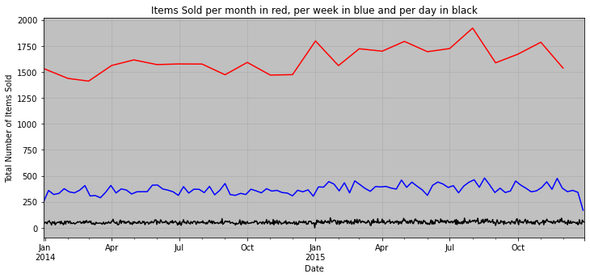
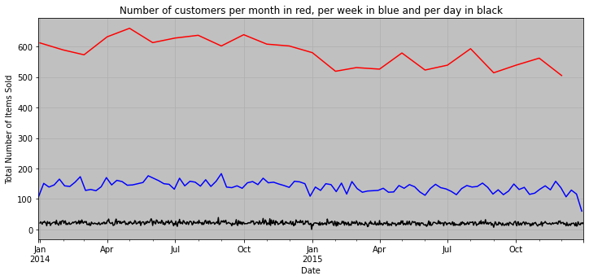
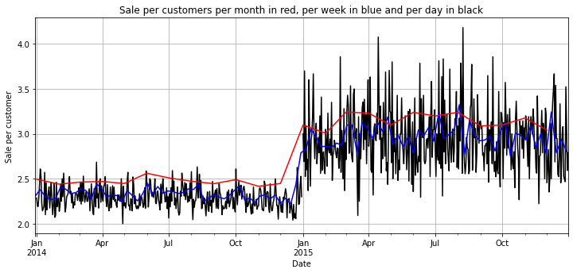
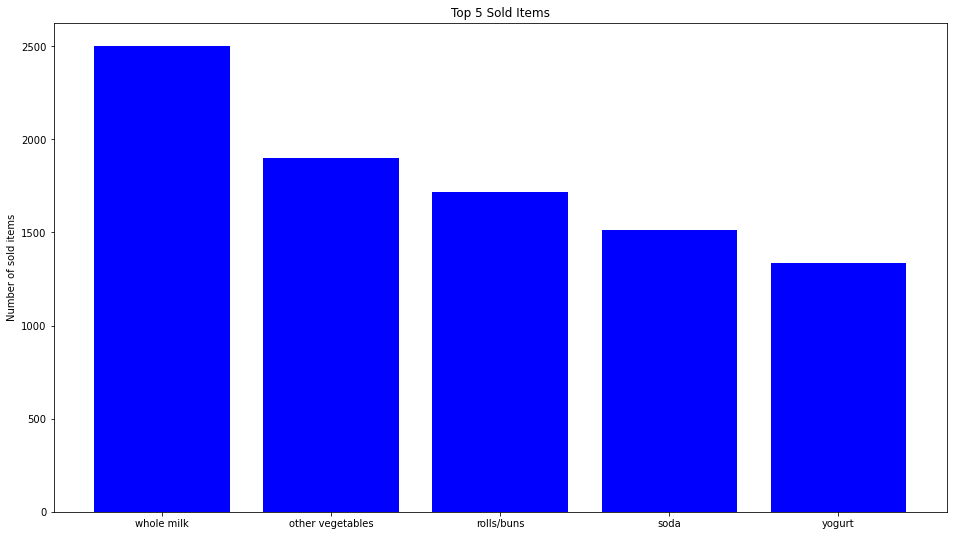
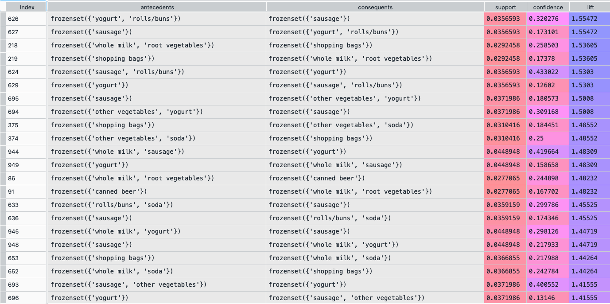
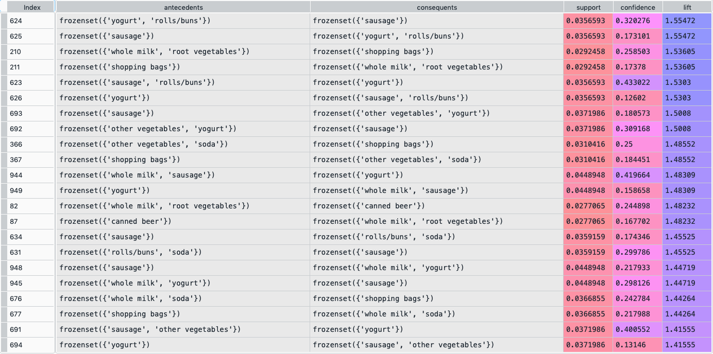

# Market Basket Analysis using Association rule learning

# What is Association rule learning?

Association rule learning is a machine learning technique used to identify patterns, associations, and relationships between variables in large datasets. It is often applied in market basket analysis, where the goal is to discover which products are frequently bought together by customers.

# ----------------------------------------------------------------

Two approaches of Asscoaite rule learning, known as appriori and FP growth, have been used to do a market basket analysis.
My code is very simple to understand and can be extended by more analysis.

# Data analysis

The items sold per month, week, and day have been plotted to see the variations and the average level of sale.

The number of customers per month, week, and day has been plotted to see the variations and the average number of customers.

The number of sale per customers for every day, every week and each month:

best selling items:

Results of apriori:

Results of FP growth:

`DISCLAIMER`:  I don't warrant this code in any way whatsoever. This code is provided "as-is" to be used at your own risk.
